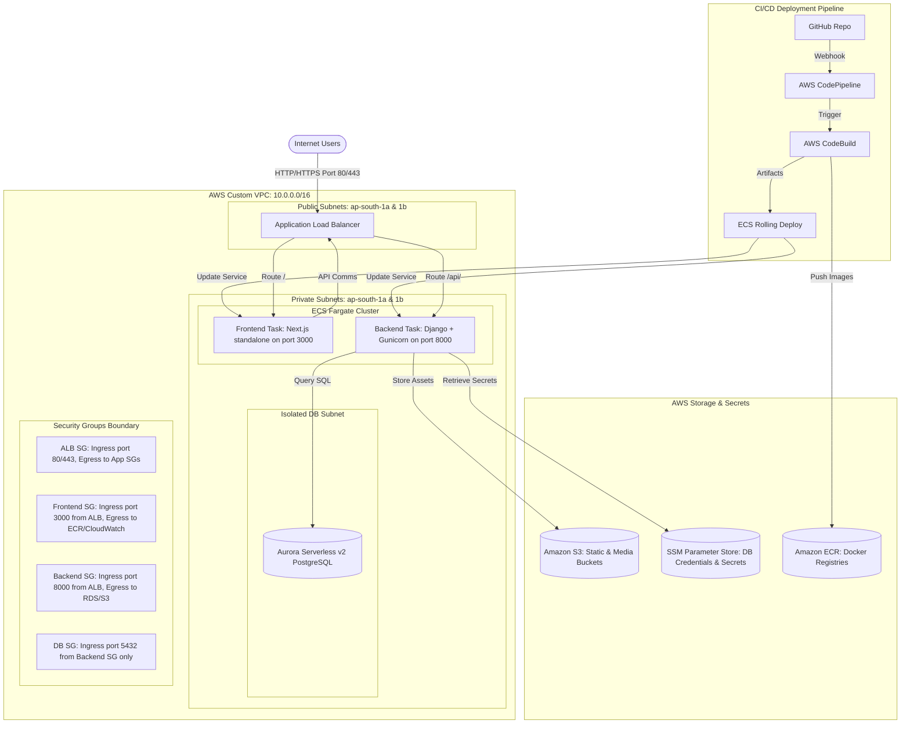

# Control Plane — Next-Gen AWS DevOps Portfolio Platform

[](https://aws.amazon.com/)
[](https://www.docker.com/)
[](https://nextjs.org/)
[](https://www.djangoproject.com/)
[](https://aws.amazon.com/rds/)

An enterprise-grade, high-availability monitoring and control dashboard portfolio platform deployed on **AWS ECS Fargate** using a fully automated **AWS CodePipeline CI/CD** rolling deployment strategy. 

This platform represents a modern 3-tier web architecture designed with security-first VPC isolation, least-privilege IAM controls, and secure externalized secrets management.

---

## 🏗️ 1. Architecture Specification

The system is deployed within a custom, secure Virtual Private Cloud (VPC) spanning multiple Availability Zones (AZs) for high availability and fault tolerance.



### Infrastructure Details:
* **Networking**: A Custom VPC with 2 Public Subnets (fronted by the Application Load Balancer) and 2 Private Subnets (hosting ECS Fargate container instances).
* **Load Balancing**: An AWS Application Load Balancer (ALB) dynamically routes incoming requests based on paths:
  * `/` and frontend routes are forwarded to the **Next.js frontend target group** on port `3000`.
  * `/api/`, `/admin/`, and backend assets are forwarded to the **Django backend target group** on port `8000`.
* **Database**: AWS RDS Aurora Serverless v2 (PostgreSQL) hosted in dedicated isolated database subnet groups, restricting ingress access to the Django backend security group.
* **Asset Storage**: Static and media assets are stored securely on Amazon S3. In compliance with modern AWS security frameworks, S3 Object Ownership is set to **Bucket Owner Enforced** (disabling legacy public ACLs).

---

## 🔒 2. Security & Credentials Architecture

### AWS Systems Manager (SSM) Parameter Store
All sensitive operational environment variables are externalized from the code repository. Task definitions retrieve configurations at launch from encrypted parameters using AWS Key Management Service (KMS):
* `/portfolio/DB_HOST` — RDS DB Hostname
* `/portfolio/DB_NAME` — RDS Database Name (`postgres`)
* `/portfolio/DB_USER` — Database Username
* `/portfolio/DB_PASSWORD` — Database Password (SecureString)
* `/portfolio/SECRET_KEY` — Django Cryptographic Secret Key (SecureString)
* `/portfolio/AWS_STORAGE_BUCKET_NAME` — S3 Asset Bucket Name

### Least-Privilege IAM Roles
The ECS Fargate tasks run using two distinct IAM roles:
1. **ECS Task Execution Role (`portfolio-ecs-execution-role`)**: Grants the ECS Agent permission to pull container images from Amazon ECR, write system logs to CloudWatch logs, and decrypt secrets from SSM Parameter Store at container boot.
2. **ECS Task Role (`portfolio-ecs-task-role`)**: Grants the running Django container permission to perform operations on AWS S3 (PutObject, GetObject) to read and write application media files.

---

## 🔄 3. Continuous Delivery & Deployment Pipeline

The delivery workflow uses a single **AWS CodePipeline** with three structured stages:

```
[GitHub Source] ──> [AWS CodeBuild] ──> [Amazon ECR] ──> [ECS Fargate Rolling Update]
```

### Step 1: Source Stage
* Tracked via a GitHub Webhook on the `main` branch. Any push triggers a CodePipeline execution.

### Step 2: Build Stage (AWS CodeBuild)
* CodeBuild pulls the source code, authenticates against Amazon ECR, and builds highly optimized production container images:
  * **Frontend**: Next.js compiled in `standalone` output mode (Node 20-alpine base image).
  * **Backend**: Django REST Framework serving requests via Gunicorn (Python 3.11-slim base image).
* Images are tagged with the specific git commit hash and pushed to ECR.
* CodeBuild generates the primary artifact `BuildArtifact` containing:
  * `imagedefinitions.json` (at the root) for the backend service.
  * `frontend-deploy/imagedefinitions.json` for the frontend service.

### Step 3: Deploy Stage (ECS Rolling Update)
* Deploys the images using the **ECS Native Rolling Deployment** model to guarantee **Zero-Downtime**:
  * **Minimum Healthy Percent (100%)**: Guarantees that at least one healthy instance of each service remains active and serves users during deployment.
  * **Maximum Percent (200%)**: Allows ECS to provision the new containers and wait for ALB health checks to pass **before** terminating the old tasks.

---

## 🚀 4. Step-by-Step Provisioning & Deploy Runbook

Follow this runbook to deploy the entire stack from scratch:

### Step 1: Networking & Security Group Setup
1. Create a custom VPC with 2 public subnets and 2 private subnets across two AZs.
2. Create four security groups:
   * `ALB-SG`: Ingress HTTP (80) & HTTPS (443) from `0.0.0.0/0`.
   * `Frontend-SG`: Ingress port `3000` from `ALB-SG` security group.
   * `Backend-SG`: Ingress port `8000` from `ALB-SG` security group.
   * `DB-SG`: Ingress port `5432` from `Backend-SG` security group only.

### Step 2: Provision Database & Storage
1. Create an Amazon S3 Bucket for static and media assets. Ensure public block access is configured and S3 Object Ownership is set to **Bucket Owner Enforced**.
2. Provision an AWS Aurora PostgreSQL Serverless v2 instance inside the private database subnets, associated with the `DB-SG` security group.

### Step 3: Configure SSM Parameter Store
1. Open the Systems Manager console and navigate to **Parameter Store**.
2. Add all parameters under the `/portfolio/` namespace:
   * `/portfolio/DB_HOST` (String)
   * `/portfolio/DB_NAME` (String, default `postgres`)
   * `/portfolio/DB_USER` (String)
   * `/portfolio/DB_PASSWORD` (SecureString)
   * `/portfolio/SECRET_KEY` (SecureString)
   * `/portfolio/AWS_STORAGE_BUCKET_NAME` (String)

### Step 4: Configure IAM Roles
1. Create `portfolio-ecs-execution-role` with `AmazonECSTaskExecutionRolePolicy` attached. Add custom permissions allowing `ssm:GetParameters` and `kms:Decrypt` for the Parameter Store resources.
2. Create `portfolio-ecs-task-role` with custom S3 permissions (`s3:PutObject`, `s3:GetObject`, `s3:DeleteObject`) scoped to your S3 bucket.
3. **Important**: Verify both roles have `ecs-tasks.amazonaws.com` in their Trust Relationship policy.

### Step 5: Register ECS Task Definitions & Services
1. Create a log group named `/ecs/portfolio-frontend` and `/ecs/portfolio-backend` in CloudWatch Logs.
2. Register the task definitions for the frontend and backend using `taskdef-frontend.json` and `taskdef-backend.json` as templates. Map variables to the SSM Parameters.
3. Create the ECS Fargate Service for both frontend and backend on your cluster, choosing **ECS Rolling Update** deployment controller.

### Step 6: Deploy CodePipeline
1. Create an ECR repository for `portfolio-frontend` and `portfolio-backend`.
2. Connect CodePipeline to your GitHub repository.
3. Configure AWS CodeBuild using the provided `buildspec.yml` to compile the Docker containers and output `BuildArtifact`.
4. Configure the Deploy stage with two Amazon ECS actions:
   * **`DeployFrontend`**: Pointing to the frontend service, using `BuildArtifact` as input and `frontend-deploy/imagedefinitions.json` as the image definitions file.
   * **`Deploy`**: Pointing to the backend service, using `BuildArtifact` as input and `imagedefinitions.json` as the image definitions file.

---

## 📈 5. Proof of Successful Deployment

The following screenshots from the AWS management console confirm the healthy, zero-downtime working state of the architecture:

### 1. CodePipeline Delivery Pipeline
Status of the 3-stage continuous integration and delivery pipeline showing **Source -> Build -> Deploy** fully completed and successful:


### 2. ECS Fargate Cluster Tasks Running
Confirmation of active, running container tasks across multiple Availability Zones on the ECS Fargate cluster:


### 3. Application Load Balancer Healthy Targets
ALB target groups indicating that both Next.js and Django Gunicorn containers are passing HTTP health checks:


### 4. AWS Systems Manager Parameter Store
Encrypted credentials and configuration variables safely stored in the Systems Manager Parameter Store:


### 5. Production Application UI
The live dashboard application rendering and communicating with the Django API backend over the Load Balancer DNS:

